<div align="center">

# 🏊🏻 Sistema de Automação da Piscina
### Documentação Técnica Completa


**📅 Última Atualização:** 31 de Janeiro de 2026  
**🏠 Sistema:** Home Assistant  
**⚡ Tecnologias:** LLM Vision • TPO • Solar PV • Watchdogs

</div>

---

## 📑 Índice

<table>
<tr>
<td width="50%">

### 🎯 Visão Geral
- [📊 Overview do Sistema](#-overview-do-sistema)
- [🏗️ Arquitetura](#️-arquitetura-do-sistema)
- [📈 Estatísticas](#-estatísticas)
- [🎨 Diagrama de Fluxo](#-diagrama-de-fluxo-principal)

</td>
<td width="50%">

### 📚 Documentação Técnica
- [⚙️ Automações Detalhadas](#️-automações-detalhadas)
- [🔗 Entidades e Sensores](#-entidades-utilizadas)
- [⚠️ Problemas Identificados](#️-problemas-identificados)
- [💡 Recomendações](#-recomendações)

</td>
</tr>
</table>

---

## 📊 Overview do Sistema

### 🎯 Objetivos Principais

<table>
<tr>
<td align="center" width="20%">
<h3>🤖</h3>
<b>IA Integrada</b><br>
<small>Visão computacional<br>para monitorização<br>automática</small>
</td>
<td align="center" width="20%">
<h3>☀️</h3>
<b>Solar First</b><br>
<small>Priorização de<br>energia fotovoltaica<br>renovável</small>
</td>
<td align="center" width="20%">
<h3>🛡️</h3>
<b>Failsafe</b><br>
<small>Múltiplas camadas<br>de segurança e<br>proteção</small>
</td>
<td align="center" width="20%">
<h3>📊</h3>
<b>Analytics</b><br>
<small>Histórico de 10 dias<br>com análise de<br>tendências</small>
</td>
<td align="center" width="20%">
<h3>⚡</h3>
<b>Automático</b><br>
<small>Zero intervenção<br>manual diária<br>necessária</small>
</td>
</tr>
</table>

### 📦 Categorias de Automação

| 🏷️ Categoria | 📊 Quantidade | 📝 Descrição | ⚡ Prioridade |
|--------------|---------------|--------------|---------------|
| 🧪 **Sistema de Cloração** | 4 automações | Sistema TPO inteligente com deteção de sal via IA | 🔴 **Crítica** |
| 🔬 **Qualidade da Água** | 5 automações | Monitorização de pH e temperatura via LLM Vision | 🟡 **Alta** |
| 💨 **Gestão de Filtragem** | 7 automações | Otimização energética e compensação noturna | 🟡 **Alta** |
| 🎮 **Controlo Manual** | 4 automações | Botões físicos, timers e overrides | 🟢 **Normal** |
| 📱 **Relatórios** | 1 automação | Resumo diário inteligente via ChatGPT | 🔵 **Baixa** |

---

## 🏗️ Arquitetura do Sistema

### 🔄 Fluxo de Dados Principal

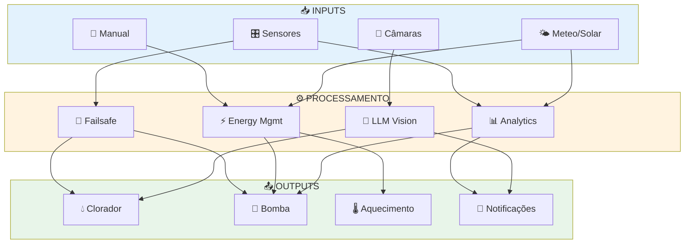

---

## 📈 Estatísticas

<div align="center">

| 📊 Métrica | 🔢 Valor | 📝 Detalhes |
|------------|----------|-------------|
| **Total de Automações** | 21 | 15 primárias + 6 auxiliares |
| **Câmaras Utilizadas** | 2 | Cave (clorador/pH) + Eira (cobertura) |
| **Modelos LLM** | 1 | GPT-4o-mini (OpenAI) |
| **Sensores Monitorizados** | 15+ | Energia, pH, temperatura, histórico |
| **Switches Controlados** | 5 | Bomba, clorador, aquecimento, cascata, hidrojet |
| **Frequência de Monitorização** | 30s-2min | Variável por automação |
| **Histórico Mantido** | 10 dias | Rotação automática de dados |
| **Modos de Operação** | 3 | Automático, Manual, Override |

</div>

---

## 🎨 Diagrama de Fluxo Principal

### 🧪 Sistema de Cloração

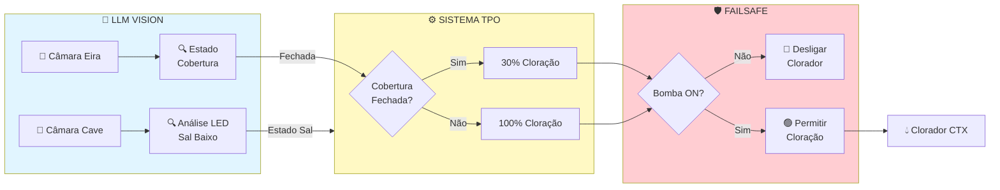

### 💨 Sistema de Filtragem

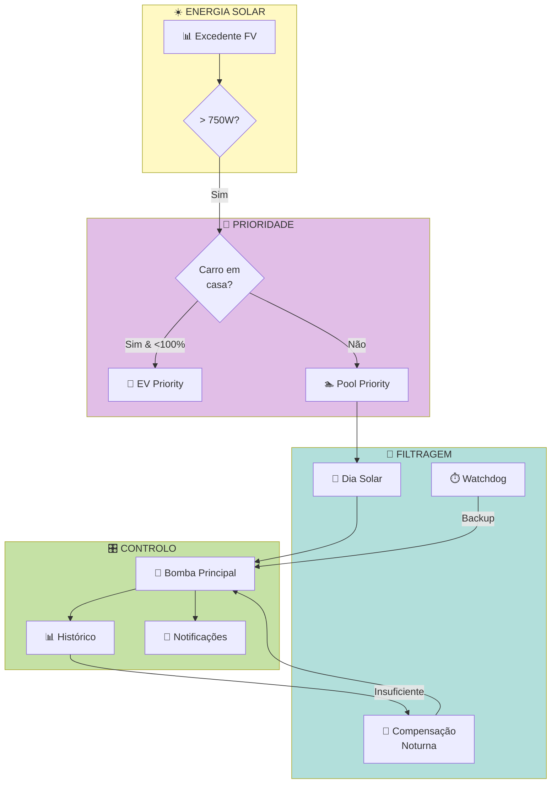

### 🔬 Monitorização de Qualidade

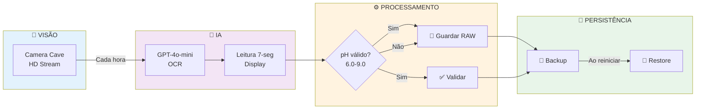

---

## ⚙️ Automações Detalhadas

> **📝 Nota:** As automações estão organizadas por categoria funcional para facilitar a compreensão do sistema.

---

### 🧪 SISTEMA DE CLORAÇÃO

<details>
<summary><h3>1️⃣ 🔍 Sal Baixo (LLM Vision + Debounce)</h3></summary>

#### 📋 Informação Geral

| Campo | Valor |
|-------|-------|
| **ID** | `piscina_llmvision_sal_baixo` |
| **Modo** | `restart` |
| **Prioridade** | 🔴 Crítica |
| **Tecnologia** | LLM Vision (GPT-4o-mini) |

#### 🎯 Função
Monitoriza o LED de "sal baixo" do clorador CTX Go Salt usando visão computacional com sistema de amostragem múltipla e debounce anti-flicker.

#### ⚡ Triggers
- ⏱️ **Time Pattern:** A cada 30 segundos
- 🔄 **Estado:** `switch.piscina_cloro_permitir_producao` ON por 30s

#### ✅ Condições
- `switch.piscina_cloro_permitir_producao` = `ON`

#### 🔄 Funcionamento Detalhado

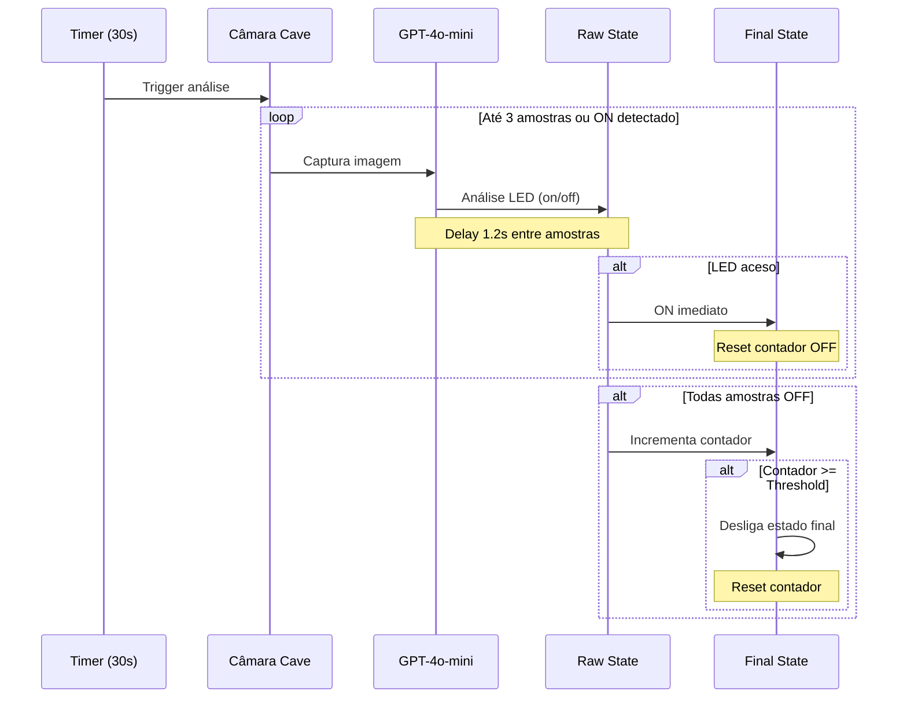

#### 🧠 Lógica de Debounce

| Fase | Ação | Propósito |
|------|------|-----------|
| **🔍 Amostragem** | 3 leituras × 1.2s | Eliminar falsos negativos |
| **⚡ Deteção Rápida** | Para ao 1º ON | Resposta imediata a problemas |
| **🛡️ Debounce OFF** | N leituras consecutivas | Evitar flickering do LED |

#### 🔧 Entidades Relacionadas

**Inputs:**
- 📸 `camera.cave_hd_stream` - Câmara do clorador
- 🔄 `switch.piscina_cloro_permitir_producao` - Estado produção

**Outputs:**
- 📊 `input_boolean.piscina_sal_baixo_raw` - Estado instantâneo
- ✅ `input_boolean.piscina_sal_baixo` - Estado filtrado (debounced)

**Configuração:**
- 🔢 `input_number.piscina_sal_baixo_off_streak` - Contador OFF
- ⚙️ `input_number.piscina_sal_baixo_off_debounce` - Threshold (padrão: 3)

**IA:**
- 🤖 Provider: `01K5S60RJSW6MFMB543KEDHE23`
- 💡 Modelo: GPT-4o-mini
- 🎯 Max Tokens: 3
- 📐 Resolução: 1280px

#### 💡 Prompt LLM

```
Observa APENAS o painel frontal do clorador CTX Go Salt.
Foca a luz/LED de SAL BAIXO (canto superior direito do painel).

Se a luz estiver acesa OU a piscar em qualquer intensidade:
  → responde: on

Caso contrário:
  → responde: off

Responde apenas com 'on' ou 'off' — sem mais texto.
```

</details>

---

<details>
<summary><h3>2️⃣ ⚙️ Cloração TPO por Cobertura</h3></summary>

#### 📋 Informação Geral

| Campo | Valor |
|-------|-------|
| **ID** | `piscina_cloro_tpo_seconds` |
| **Modo** | `single` |
| **Prioridade** | 🔴 Crítica |
| **Tipo** | Time Proportional Output |

#### 🎯 Função
Sistema TPO (Time Proportional Output) que liga/desliga o clorador em ciclos para atingir percentagem alvo de tempo de operação, ajustando-se dinamicamente ao estado da cobertura.

#### ⚡ Triggers
- ⏱️ **Time Pattern:** A cada 30 segundos

#### ✅ Condições
- `input_boolean.piscina_cloro_tpo_enable` = `ON`
- `switch.bomba_piscina_switch_0` = `ON`

#### 🔄 Funcionamento TPO

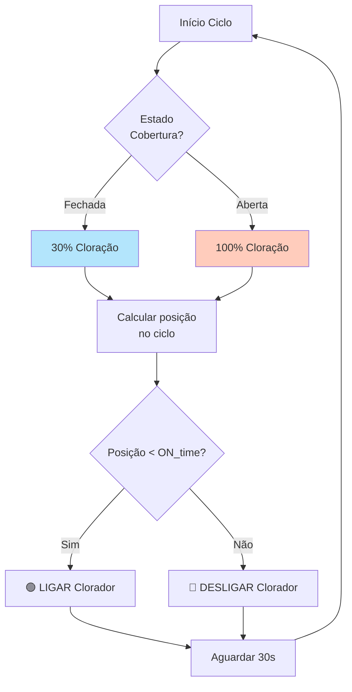

#### 📊 Configuração de Percentagens

| Estado Cobertura | Percentagem | Input | Razão |
|------------------|-------------|-------|-------|
| 🔒 **Fechada** | 30% | `input_number.piscina_pct_cobertura_fechada` | Menos evaporação de cloro |
| 🔓 **Aberta** | 100% | `input_number.piscina_pct_cobertura_aberta` | Maior consumo e UV |

#### 🧮 Cálculo do Ciclo

```python
# Variáveis
janela_min = input_number.piscina_cloro_janela_min  # Ex: 10 min
janela_s = janela_min * 60  # 600s

# Percentagem baseada na cobertura
pct = pct_fechada if cobertura_fechada else pct_aberta

# Tempo ON no ciclo
on_s = (pct / 100) * janela_s

# Posição atual no ciclo (rotativo)
ciclo_s = now().timestamp() % janela_s

# Decisão
if pct >= 99:
    clorador = ON  # Sempre ligado
elif pct <= 1:
    clorador = OFF  # Sempre desligado
elif ciclo_s < on_s:
    clorador = ON
else:
    clorador = OFF
```

#### 🔧 Entidades Relacionadas

**Inputs:**
- 🔄 `input_boolean.piscina_cobertura_fechada` - Estado cobertura
- 💨 `switch.bomba_piscina_switch_0` - Bomba ativa
- ⚙️ `input_boolean.piscina_cloro_tpo_enable` - Enable TPO

**Configuração:**
- ⏱️ `input_number.piscina_cloro_janela_min` - Duração janela
- 🔒 `input_number.piscina_pct_cobertura_fechada` - % fechada
- 🔓 `input_number.piscina_pct_cobertura_aberta` - % aberta

**Output:**
- 💧 `switch.piscina_cloro_permitir_producao` - Controlo clorador

#### 🔗 Integração
- **Depende de:** #4 (Estado da Cobertura)
- **Protegida por:** #3 (Failsafe)

</details>

---

<details>
<summary><h3>3️⃣ 🛡️ Cloração TPO Failsafe</h3></summary>

#### 📋 Informação Geral

| Campo | Valor |
|-------|-------|
| **ID** | `piscina_cloro_tpo_failsafe` |
| **Modo** | `restart` |
| **Prioridade** | 🔴 Crítica |
| **Tipo** | Safety System |

#### 🎯 Função
Sistema de segurança crítico que garante o desligamento IMEDIATO do clorador em condições inseguras, protegendo o equipamento de operar em seco.

#### ⚡ Triggers
- 🔄 **Estado:** Mudança em `switch.bomba_piscina_switch_0`
- 🔄 **Estado:** Mudança em `input_boolean.piscina_cloro_tpo_enable`
- 🔄 **Estado:** Mudança em `input_boolean.piscina_cobertura_fechada`

#### ✅ Condições de Desligamento

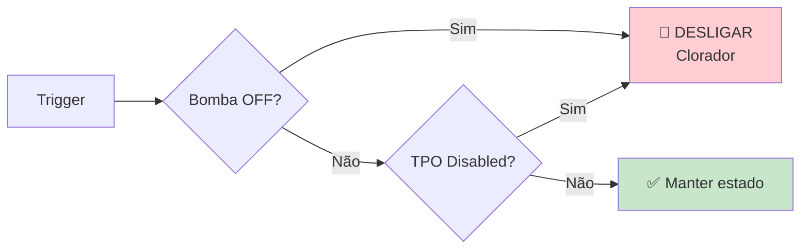

#### ⚠️ Situações de Risco

| Condição | Risco | Ação |
|----------|-------|------|
| 💨 **Bomba OFF** | Clorador sem circulação | 🔴 Desligar imediato |
| ⚙️ **TPO Disabled** | Sistema desativado manualmente | 🔴 Desligar imediato |

#### 🔧 Entidades Relacionadas

**Inputs (Monitorizados):**
- 💨 `switch.bomba_piscina_switch_0`
- ⚙️ `input_boolean.piscina_cloro_tpo_enable`
- 🔄 `input_boolean.piscina_cobertura_fechada`

**Output:**
- 💧 `switch.piscina_cloro_permitir_producao` ➜ `OFF`

#### 💡 Importância
> ⚠️ **SISTEMA CRÍTICO**: Protege o clorador de funcionar em seco, o que pode causar danos permanentes ao equipamento e liberação perigosa de gás cloro.

</details>

---

<details>
<summary><h3>4️⃣ 📸 Estado da Cobertura (LLM Vision)</h3></summary>

#### 📋 Informação Geral

| Campo | Valor |
|-------|-------|
| **ID** | `piscina_llmvision_cobertura` |
| **Modo** | `restart` |
| **Prioridade** | 🟡 Alta |
| **Tecnologia** | LLM Vision (GPT-4o-mini) |

#### 🎯 Função
Deteta automaticamente se a cobertura da piscina está fechada ou aberta usando análise de imagem por IA com lógica de estado persistente.

#### ⚡ Triggers
- 🔄 **Estado:** Bomba ON por 5 minutos
- ⏱️ **Time Pattern:** A cada 30 minutos

#### ✅ Condições
- `switch.bomba_piscina_switch_0` = `ON`

#### 🧠 Lógica de Deteção

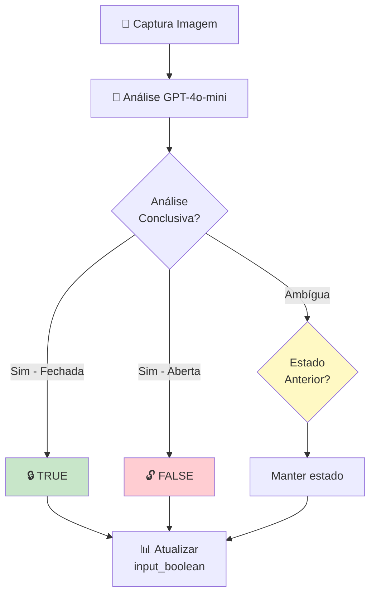

#### 💡 Prompt LLM

```
TAREFA: Classificar a imagem de uma piscina com cobertura branca.

CRITÉRIO:
- "true" se a cobertura cobre toda a água
  (ripas/linhas e reflexos contam como fechada)
- "false" se se vê água descoberta ~10% ou abertura evidente

CONTEXTO:
- Estado anterior: {{ 'true' if fechada else 'false' }}
- Se a imagem for ambígua, responde com o Estado anterior

RESPOSTA: 
Responde EXACTAMENTE: true ou false (minúsculas), sem mais texto.
```

#### 🔧 Entidades Relacionadas

**Input:**
- 📸 `camera.eira_piscina_hd_stream` - Câmara da piscina
- 💨 `switch.bomba_piscina_switch_0` - Estado bomba

**Output:**
- 🔄 `input_boolean.piscina_cobertura_fechada` - Estado cobertura

**IA:**
- 🤖 Provider: `01K5S60RJSW6MFMB543KEDHE23`
- 💡 Modelo: GPT-4o-mini
- 🎯 Max Tokens: 1
- 📐 Resolução: 960px

#### 🔗 Integração
- **Alimenta:** #2 (Cloração TPO) - Ajusta percentagem de cloração
- **Relacionada:** #5 (Verificar ao parar bomba)

</details>

---

### 🔬 QUALIDADE DA ÁGUA

<details>
<summary><h3>5️⃣ 🚨 Verificar Cobertura ao Parar Bomba</h3></summary>

#### 📋 Informação Geral

| Campo | Valor |
|-------|-------|
| **ID** | `piscina_cobertura_quando_bomba_para` |
| **Modo** | `restart` |
| **Prioridade** | 🟡 Alta |
| **Tipo** | Safety Alert |

#### 🎯 Função
Verifica estado da cobertura quando bomba para e envia alerta Telegram se estiver aberta, garantindo segurança noturna.

#### ⚡ Triggers
- 🔄 **Estado:** Bomba OFF por 15 minutos
- 🌅 **Sun:** Ao pôr do sol

#### 🔄 Funcionamento

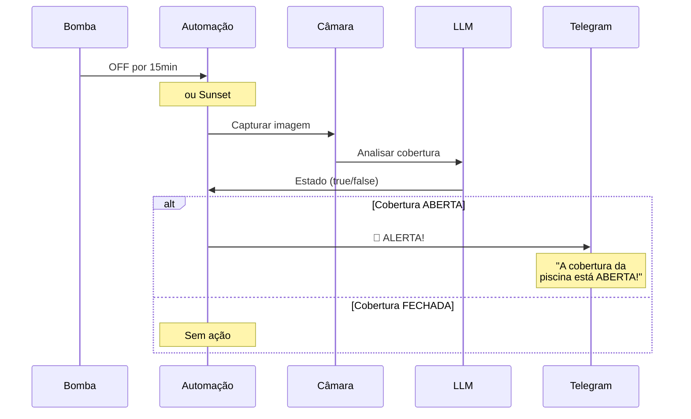

#### 🔧 Entidades Relacionadas

**Input:**
- 💨 `switch.bomba_piscina_switch_0`
- 📸 `camera.eira_piscina_hd_stream`

**Output:**
- 🔄 `input_boolean.piscina_cobertura_fechada`
- 📱 `telegram_bot.send_message`

#### 📱 Mensagem de Alerta
> 🚨 A cobertura da piscina está ABERTA!

</details>

---

<details>
<summary><h3>6️⃣ 🧪 pH (Monitorização Contínua)</h3></summary>

#### 📋 Informação Geral

| Campo | Valor |
|-------|-------|
| **ID** | `piscina_ph_ocr` |
| **Modo** | `restart` |
| **Prioridade** | 🟡 Alta |
| **Tecnologia** | LLM OCR (GPT-4o-mini) |

#### 🎯 Função
Lê automaticamente o valor de pH do display da bomba usando OCR/LLM, com leituras de hora a hora enquanto bomba está ativa.

#### ⚡ Triggers
- 🔄 **Estado:** Bomba ON por 5 minutos

#### 🔄 Ciclo de Leitura

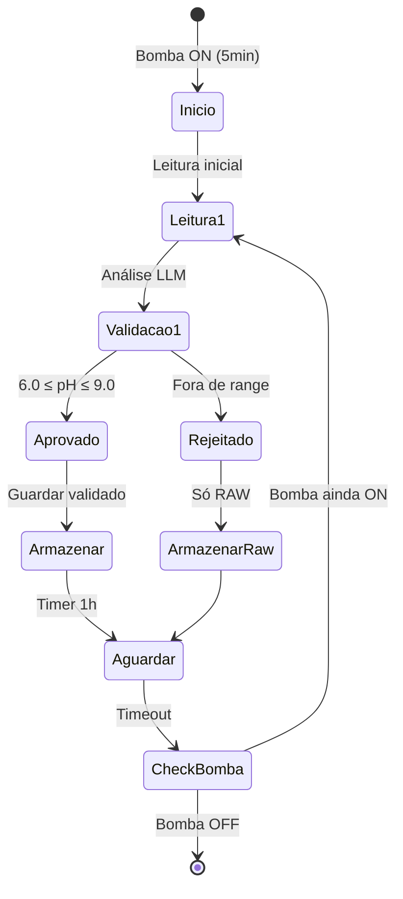

#### 🧮 Validação de pH

| Condição | Range | Ação |
|----------|-------|------|
| ✅ **Válido** | 6.0 - 9.0 | Atualizar ambos (RAW + validado) |
| ⚠️ **Inválido** | < 6.0 ou > 9.0 | Só atualizar RAW |
| ❌ **Erro** | - | Manter valores anteriores |

#### 💡 Prompt LLM

```
TAREFA: Ler o valor de pH no visor da bomba (dígitos 7-seg).

REGRAS:
- Devolve apenas um número com PONTO e 1 decimal (ex.: 7.3)
- Se não vires o ponto mas leres dois dígitos (ex.: 73),
  interpreta como 7.3

RESPOSTA: apenas o número.
```

#### 🔧 Entidades Relacionadas

**Input:**
- 📸 `camera.cave_hd_stream` - Câmara do display
- 💨 `switch.bomba_piscina_switch_0` - Estado bomba

**Output:**
- 📊 `input_number.ph_piscina_raw` - Leitura não filtrada
- ✅ `input_number.ph_piscina` - Leitura validada

**IA:**
- 🤖 Provider: `01K5S60RJSW6MFMB543KEDHE23`
- 💡 Modelo: GPT-4o-mini
- 🎯 Max Tokens: 5
- 🌡️ Temperature: 0 (determinístico)
- 📐 Resolução: 1280px

#### 🔗 Integração
- **Alimenta:** #7 (Backup automático)
- **Restaurado por:** #8 (Restore no arranque)

</details>

---

<details>
<summary><h3>7️⃣ 💾 pH Backup Automático</h3></summary>

#### 📋 Informação Geral

| Campo | Valor |
|-------|-------|
| **ID** | `piscina_ph_backup_on_change` |
| **Modo** | `queued` |
| **Prioridade** | 🟢 Normal |
| **Tipo** | Data Persistence |

#### 🎯 Função
Cria backups automáticos dos valores de pH sempre que mudam, permitindo recuperação após reinícios do sistema.

#### ⚡ Triggers
- 🔄 **Estado:** Mudança em `input_number.ph_piscina`
- 🔄 **Estado:** Mudança em `input_number.ph_piscina_raw`

#### 🔄 Fluxo de Backup

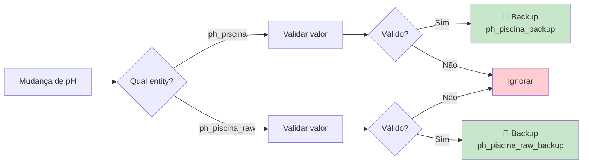

#### ✅ Validação de Dados

Valores ignorados:
- ❌ `unknown`
- ❌ `unavailable`
- ❌ `none`
- ❌ `0` ou `0.0`

#### 📝 Formato de Backup

- **pH Validado:** `"%.2f"` (ex: `"7.30"`)
- **pH RAW:** Valor original como string

#### 🔧 Entidades Relacionadas

**Input:**
- 📊 `input_number.ph_piscina`
- 📊 `input_number.ph_piscina_raw`

**Output:**
- 💾 `input_text.ph_piscina_backup`
- 💾 `input_text.ph_piscina_raw_backup`

</details>

---

<details>
<summary><h3>8️⃣ 🔄 pH Restore no Arranque</h3></summary>

#### 📋 Informação Geral

| Campo | Valor |
|-------|-------|
| **ID** | `piscina_ph_restore_on_start` |
| **Modo** | `single` |
| **Prioridade** | 🟢 Normal |
| **Tipo** | Data Recovery |

#### 🎯 Função
Restaura automaticamente os valores de pH a partir dos backups quando Home Assistant reinicia.

#### ⚡ Triggers
- 🔄 **Evento:** `homeassistant.start`

#### 🔄 Processo de Restauração

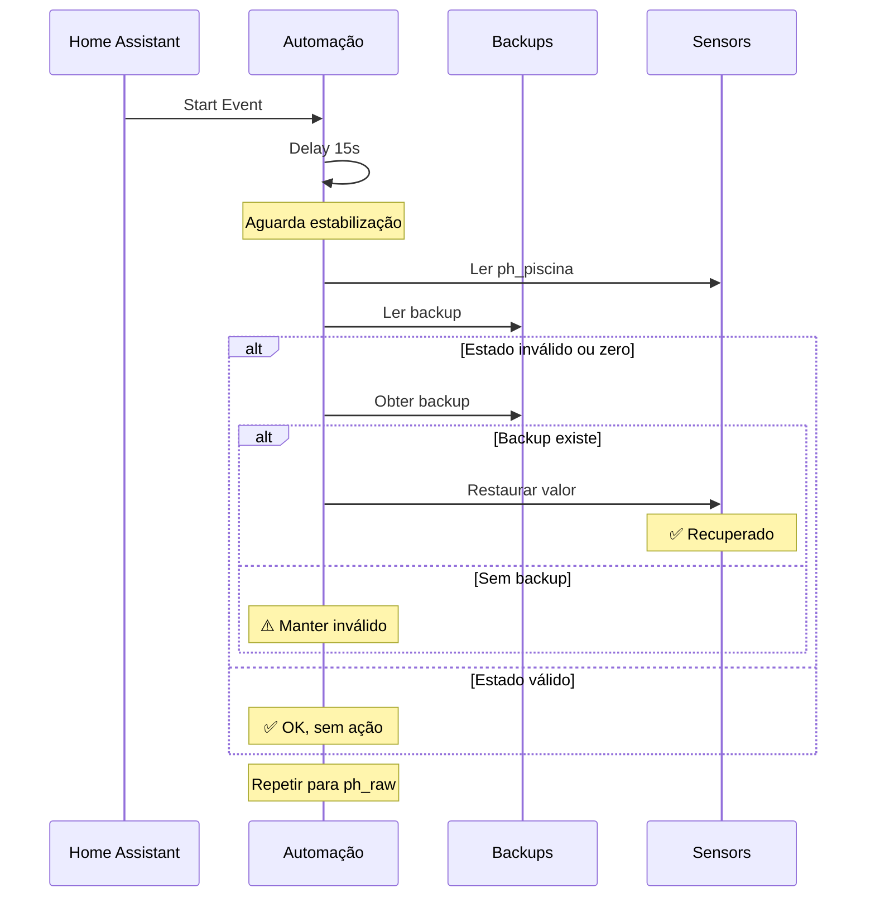

#### 🔧 Entidades Relacionadas

**Backups (Input):**
- 💾 `input_text.ph_piscina_backup`
- 💾 `input_text.ph_piscina_raw_backup`

**Sensors (Output):**
- 📊 `input_number.ph_piscina`
- 📊 `input_number.ph_piscina_raw`

#### ⏱️ Sequência
1. ⏳ Delay 15s (estabilização sistema)
2. 🔍 Verificar pH validado
3. 🔄 Restaurar se necessário
4. 🔍 Verificar pH RAW
5. 🔄 Restaurar se necessário

</details>

---

<details>
<summary><h3>9️⃣ 🌡️ Atualizar Temperatura Filtrada</h3></summary>

#### 📋 Informação Geral

| Campo | Valor |
|-------|-------|
| **ID** | `atualizar_temperatura_piscina_filtrado_com_bomba_d` |
| **Modo** | `single` |
| **Prioridade** | 🟢 Normal |
| **Tipo** | Data Filtering |

#### 🎯 Função
Atualiza temperatura filtrada quando aquecimento está ativo por tempo suficiente para estabilização.

#### ⚡ Triggers
- ⏱️ **Time Pattern:** A cada 5 minutos

#### ✅ Condições
- 🌡️ `switch.aquecimento_piscina_channel_1` ON por **10+ minutos**
- 📊 `sensor.bomba_piscina_temperature` disponível

#### 🔄 Funcionamento
Simples cópia após período de estabilização térmico.

#### 🔧 Entidades Relacionadas

**Input:**
- 🌡️ `switch.aquecimento_piscina_channel_1`
- 📊 `sensor.bomba_piscina_temperature`

**Output:**
- 📊 `input_number.temperatura_piscina_filtrado`

</details>

---

### 💨 GESTÃO DE FILTRAGEM

<details>
<summary><h3>🔟 🌙 Bomba Piscina Noite (Compensação)</h3></summary>

#### 📋 Informação Geral

| Campo | Valor |
|-------|-------|
| **ID** | `bomba_piscina_noite` |
| **Modo** | `single` |
| **Prioridade** | 🟡 Alta |
| **Tipo** | Compensatory System |

#### 🎯 Função
Sistema inteligente que liga bomba à noite para compensar filtragem solar insuficiente durante o dia, com ajuste sazonal automático.

#### ⚡ Triggers
- ⏰ **Time:** 00:00:00 (meia-noite)
- ⏰ **Time:** `input_datetime.horario_piscina_noite` (dinâmico)

#### ✅ Condições de Ativação

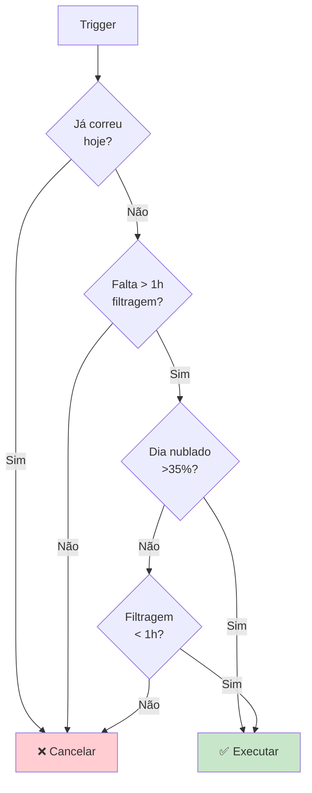

#### 📊 Cálculo de Necessidade

##### Thresholds Sazonais

| Estação | Threshold | Input |
|---------|-----------|-------|
| ☀️ **Verão/Primavera** | 240 min (4h) | `input_number.pool_pump_duration_lower_threshold` |
| ❄️ **Outono/Inverno** | 120 min (2h) | `input_number.pool_pump_duration_inverno` |

##### Fórmula

```python
# Determinar threshold ativo
threshold = threshold_verao if estacao in ['summer', 'spring'] else threshold_inverno

# Converter para segundos
threshold_segundos = threshold * 60

# Calcular défice
tempo_compensar = max(threshold_segundos - filtragem_ontem, 0)

# Decisão
if tempo_compensar > 3600:  # Mais de 1 hora
    executar_compensacao()
```

#### 🔄 Sequência de Execução

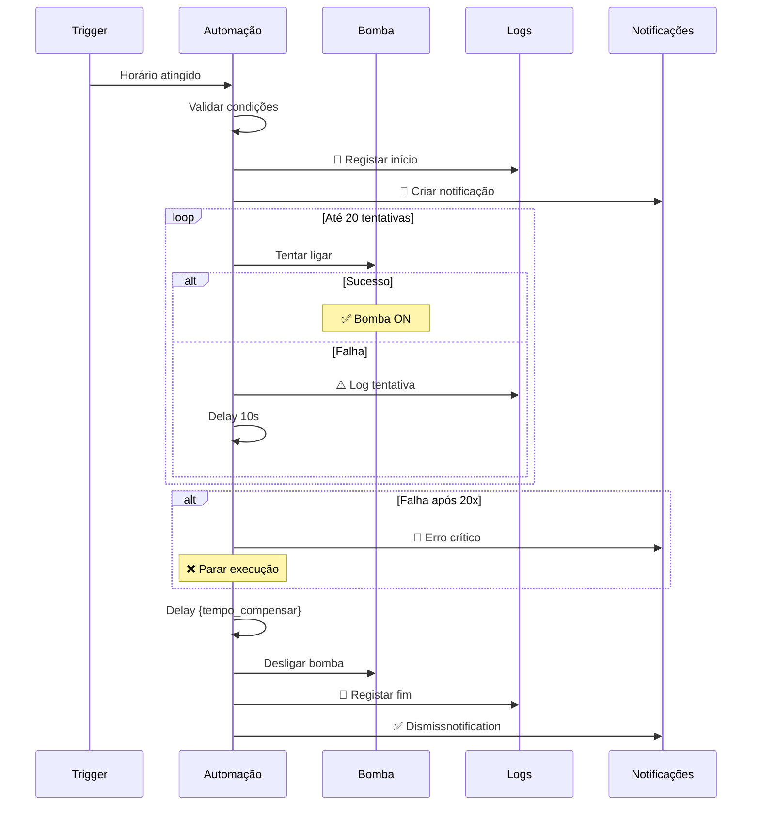

#### 🛡️ Sistema de Retry

| Parâmetro | Valor | Razão |
|-----------|-------|-------|
| **Max Tentativas** | 20 | Garantir alta disponibilidade |
| **Delay entre tentativas** | 10s | Evitar sobrecarga |
| **Verificação** | Após cada tentativa | Confirmar estado real |

#### 📊 Variáveis Calculadas

```yaml
filtragem_ontem: 
  sensor.filtragem_piscina_historico_s (atributo 'today-1')

filtragem_hoje: 
  sensor.filtragem_piscina_historico_s

cobertura_nuvens: 
  sensor.media_de_cobertura_de_nuvens_10_00_18_00

e_verao_primavera: 
  sensor.season in ['summer', 'spring']

tempo_compensar: 
  max(threshold - filtragem_ontem, 0)

ja_correu_hoje: 
  last_triggered.date() == now().date()
```

#### 🔧 Entidades Relacionadas

**Inputs:**
- 📊 `sensor.filtragem_piscina_historico_s` - Histórico dias
- 🌤️ `sensor.media_de_cobertura_de_nuvens_10_00_18_00` - Meteo
- 🍂 `sensor.season` - Estação do ano
- ⏰ `input_datetime.horario_piscina_noite` - Horário dinâmico

**Configuração:**
- ⚙️ `input_number.pool_pump_duration_lower_threshold` - Verão
- ⚙️ `input_number.pool_pump_duration_inverno` - Inverno

**Output:**
- 💨 `switch.bomba_piscina_switch_0` - Bomba
- 📝 `system_log` - Logging
- 🔔 `persistent_notification` - Notificações

#### 📝 Exemplo de Log

```
Bomba Piscina Noite iniciada:
  Trigger=horario_dinamico
  Filtragem ontem=2.5h
  Threshold=4h (verão/primavera)
  Tempo a compensar=90min
  Nuvens=45%
```

</details>

---

<details>
<summary><h3>1️⃣1️⃣ 🔀 Prioridade EV vs Piscina</h3></summary>

#### 📋 Informação Geral

| Campo | Valor |
|-------|-------|
| **ID** | `ligardesligar_automacao_piscina` |
| **Modo** | `single` |
| **Prioridade** | 🟡 Alta |
| **Tipo** | Priority Management |

#### 🎯 Função
Coordena prioridade entre carregamento do veículo elétrico e filtragem da piscina durante dia, baseado em disponibilidade solar.

#### ⚡ Triggers
- ⏱️ **Time Pattern:** A cada 5 minutos

#### 🔄 Lógica de Prioridade

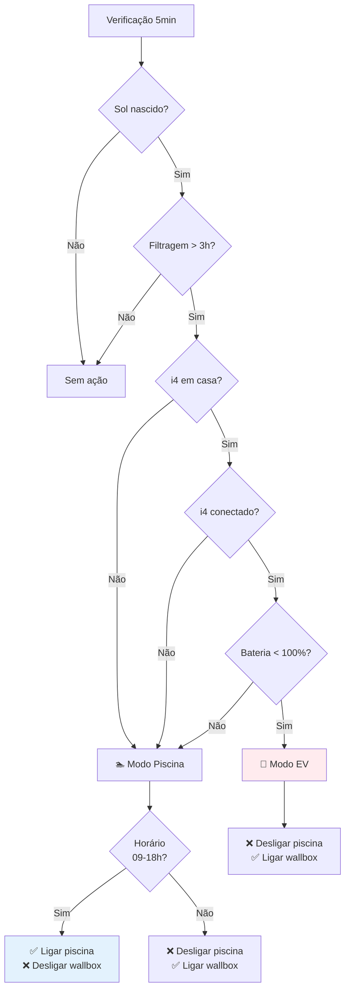

#### 📊 Condições de Prioridade

##### 🚗 Prioridade ao EV (desliga piscina)

| Condição | Estado Requerido |
|----------|------------------|
| 🌅 Sol | Nascido e não posto |
| ⏱️ Filtragem diária | > 3 horas (10800s) |
| 🚗 i4 localização | `home` |
| 🔌 i4 conexão | `on` |
| 🔋 i4 bateria | < 100% |

**Ações:**
1. ❌ Desligar `automation.bomba_piscina_dia` (com stop_actions)
2. ❌ Desligar `switch.bomba_piscina_switch_0`
3. ✅ Ligar `switch.wallbox_charging_enabled`

##### 🏊 Prioridade à Piscina (09:00-18:00)

**Ações:**
1. ✅ Ligar `automation.bomba_piscina_dia`
2. ❌ Desligar `switch.wallbox_charging_enabled` (desabilitado)
3. ⚡ Trigger `automation.bomba_piscina_dia` (com skip_condition)

##### ⏰ Fora de Horário

**Ações:**
1. ❌ Desligar `automation.bomba_piscina_dia` (com stop_actions)
2. ✅ Ligar `switch.wallbox_charging_enabled` (desabilitado)

#### 🔧 Entidades Relacionadas

**Inputs:**
- 🌅 `sun.sun` - Estado sol
- 📊 `sensor.duracao_filtragem_piscina_diario_em_segundos` - Tempo hoje
- 🚗 `device_tracker.i4_edrive40` - Localização
- 🔌 `binary_sensor.i4_edrive40_connection_status` - Ligado
- 🔋 `sensor.i4_edrive40_remaining_battery_percent` - Bateria

**Outputs:**
- 💨 `switch.bomba_piscina_switch_0`
- 🔌 `switch.wallbox_charging_enabled`
- ⚙️ `automation.bomba_piscina_dia`

#### ⚠️ PROBLEMA IDENTIFICADO

> 🔴 **CRÍTICO**: Automação `automation.bomba_piscina_dia` não existe!
> 
> Esta automação referencia uma automação inexistente, o que causa falhas nas operações de ligar/desligar e trigger.

</details>

---

<details>
<summary><h3>1️⃣2️⃣ 📊 Histórico de Filtragem</h3></summary>

#### 📋 Informação Geral

| Campo | Valor |
|-------|-------|
| **ID** | `variable_piscina_timer` |
| **Modo** | `single` |
| **Prioridade** | 🟡 Alta |
| **Tipo** | Data Retention |

#### 🎯 Função
Mantém histórico rotativo de 10 dias da duração diária de filtragem para análise de tendências e decisões.

#### ⚡ Triggers
- ⏰ **Time:** 00:00:00 (meia-noite)

#### 🔄 Rotação de Dados

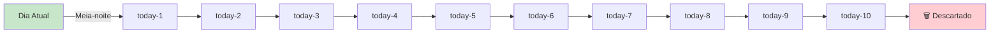

#### 📊 Estrutura de Dados

```yaml
sensor.filtragem_piscina_historico_s:
  state: 14400  # Valor de hoje (em segundos)
  attributes:
    today-1: 12600   # Ontem
    today-2: 15800   # Anteontem
    today-3: 10200   # ...
    today-4: 14100
    today-5: 16200
    today-6: 13500
    today-7: 11800
    today-8: 15600
    today-9: 12900
    today-10: 14700  # 10 dias atrás
```

#### 🔧 Entidades Relacionadas

**Input:**
- 📊 `sensor.duracao_filtragem_piscina_diario_em_segundos`

**Output:**
- 📊 `sensor.filtragem_piscina_historico_s` (+ 10 atributos)

**Action:**
- ⚙️ `variable.update_sensor`

#### 🔗 Integração
- **Alimenta:** #10 (Bomba Noite) - Usa `today-1` para decisões
- **Usado em:** Análises de tendências e relatórios

</details>

---

<details>
<summary><h3>1️⃣3️⃣ ☀️ Arranque por Excedente Solar</h3></summary>

#### 📋 Informação Geral

| Campo | Valor |
|-------|-------|
| **ID** | `automacao_bomba_piscina` |
| **Modo** | `single` |
| **Prioridade** | 🟡 Alta |
| **Tipo** | Solar Optimization |

#### 🎯 Função
Liga/desliga bomba automaticamente baseando-se em excedente ou importação de energia da rede.

#### ⚡ Triggers

| Trigger | Threshold | ID | Ação |
|---------|-----------|-----|------|
| 📈 Excedente | < -750W | ON | Ligar bomba |
| 📉 Importação | > +750W | OFF | Desligar bomba |

**Sensor:** `sensor.potencia_emonpi_import_export_media_5_minutos`

#### ✅ Condições
- 🌅 Sol nascido e antes do pôr do sol

#### 🔄 Funcionamento

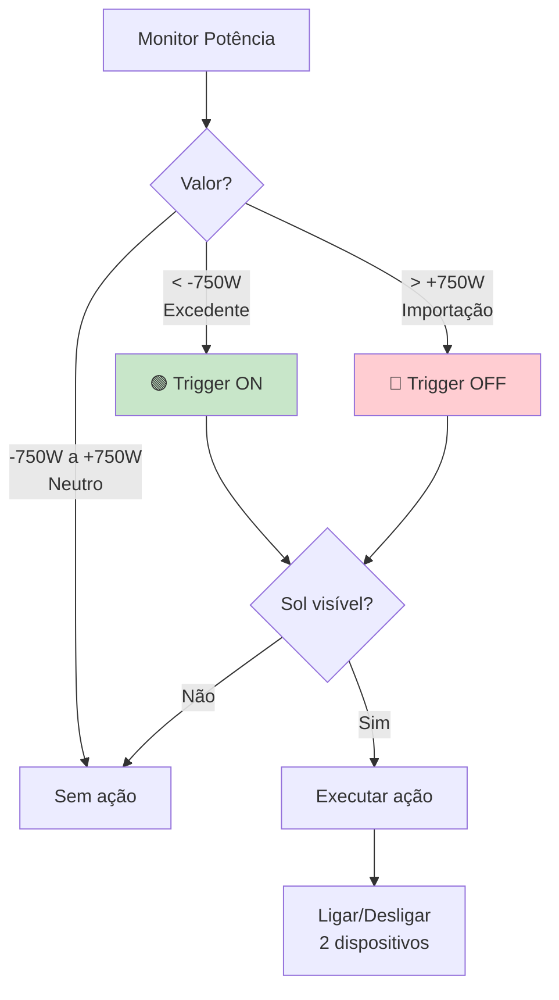

#### 🔧 Entidades Relacionadas

**Input:**
- 📊 `sensor.potencia_emonpi_import_export_media_5_minutos`
- 🌅 `sun.sun`

**Outputs:**
- 🔄 Dispositivo 1: `d1b3ca4d6a019622064ef94336bbd650`
- 🔄 Dispositivo 2: `ae742d0d2f0dc5dea53a674346911926`

#### ⚠️ Nota sobre IDs

> Os switches usam device IDs em vez de entity IDs legíveis. Recomenda-se conversão para melhor manutenibilidade.

</details>

---

<details>
<summary><h3>1️⃣4️⃣ ☀️ Arranque com Excedente FV</h3></summary>

#### 📋 Informação Geral

| Campo | Valor |
|-------|-------|
| **ID** | `piscina_-_arranque_com_excedente_fv` |
| **Modo** | `single` |
| **Prioridade** | 🟡 Alta |
| **Tipo** | Solar Trigger |

#### 🎯 Função
Versão dedicada do arranque solar com sensor binário específico para piscina.

#### ⚡ Triggers
- 🔄 **Estado:** `binary_sensor.piscina_excedente_fv_bomba` ON por **2 minutos**

#### ✅ Condições
- 📊 `input_number.piscina_filtracao_min_restantes` > 0
- 🌅 Sol nascido (+15min) até pôr do sol (-15min)

#### 🔧 Entidades Relacionadas

**Inputs:**
- 🔄 `binary_sensor.piscina_excedente_fv_bomba`
- 📊 `input_number.piscina_filtracao_min_restantes`

**Outputs:**
- 💨 `switch.bomba_piscina`
- 💨 `switch.bomba_piscina_switch_0`

</details>

---

<details>
<summary><h3>1️⃣5️⃣ 🔍 Watchdog Arranque FV</h3></summary>

#### 📋 Informação Geral

| Campo | Valor |
|-------|-------|
| **ID** | `piscina_-_watchdog_arranque_fv_2min_v2` |
| **Modo** | `single` |
| **Prioridade** | 🟡 Alta |
| **Tipo** | Watchdog / Failsafe |

#### 🎯 Função
Sistema de backup que verifica a cada 2 minutos se bomba deveria estar ligada por excedente solar, garantindo arranque mesmo se automação #14 falhar.

#### ⚡ Triggers
- ⏱️ **Time Pattern:** A cada 2 minutos

#### ✅ Condições (Todas Requeridas)

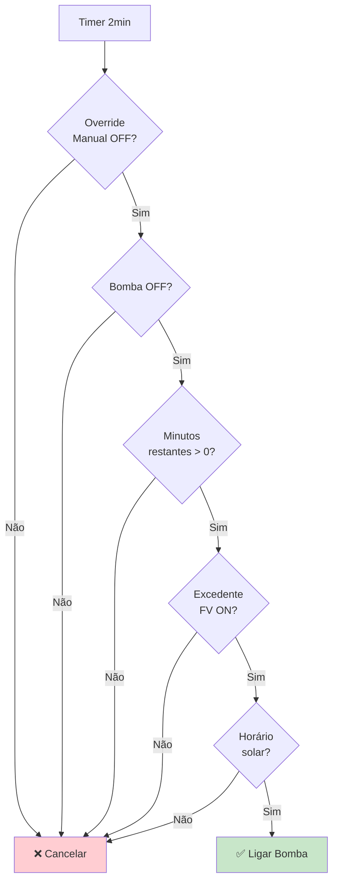

#### 🔧 Entidades Relacionadas

**Inputs:**
- 🔄 `input_boolean.piscina_override_manual`
- 💨 `switch.bomba_piscina_switch_0`
- 📊 `input_number.piscina_filtracao_min_restantes`
- 🔄 `binary_sensor.piscina_excedente_fv_bomba`

**Output:**
- 💨 `switch.bomba_piscina_switch_0`

#### 🔗 Relação com #14

| Aspeto | #14 Arranque FV | #15 Watchdog |
|--------|-----------------|--------------|
| **Trigger** | Sensor ON 2min | Timer 2min |
| **Função** | Principal | Backup |
| **Prioridade** | 1ª linha | Failsafe |
| **Redundância** | Não | Sim |

</details>

---

<details>
<summary><h3>1️⃣6️⃣ ⏰ Atualizar Horário Noturno</h3></summary>

#### 📋 Informação Geral

| Campo | Valor |
|-------|-------|
| **ID** | `actualizar_horario_bomba_piscina_noite` |
| **Modo** | `single` |
| **Prioridade** | 🟢 Normal |
| **Tipo** | Configuration Sync |

#### 🎯 Função
Sincroniza `input_datetime.horario_piscina_noite` com horário calculado dinamicamente pelo sensor, permitindo ajuste automático.

#### ⚡ Triggers
- ⏱️ **Time Pattern:** A cada 30 minutos
- 🔄 **Estado:** Mudança em `sensor.bomba_piscina_noite_horario`

#### ✅ Condições
- 🕐 Horário entre **13:00 e 21:00**

#### 🔄 Lógica de Atualização

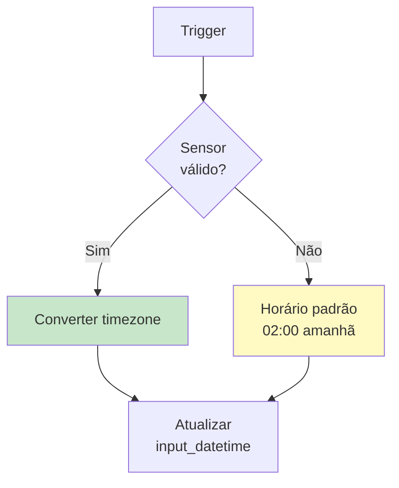

#### 🔧 Entidades Relacionadas

**Input:**
- 📊 `sensor.bomba_piscina_noite_horario`

**Output:**
- ⏰ `input_datetime.horario_piscina_noite`

#### 🔗 Integração
- **Alimenta:** #10 (Bomba Noite) - Define horário de trigger

</details>

---

### 🎮 CONTROLO MANUAL

<details>
<summary><h3>1️⃣7️⃣ 🔘 Botão Bomba Manual</h3></summary>

#### 📋 Informação Geral

| Campo | Valor |
|-------|-------|
| **ID** | `bomba_piscina_botao` |
| **Modo** | `single` |
| **Prioridade** | 🟢 Normal |
| **Tipo** | Physical Control |

#### 🎯 Função
Toggle manual da bomba através de botão físico BTHome.

#### ⚡ Triggers
- 🔘 **Device:** Botão BTHome (pressão simples)
  - Device ID: `e6ae30b2d7855ae2d2b83b4497674bfb`

#### 🔄 Funcionamento
Simples toggle ON/OFF.

#### 🔧 Entidades Relacionadas

**Input:**
- 🔘 BTHome Button

**Output:**
- 💨 `ae742d0d2f0dc5dea53a674346911926` (bomba)

</details>

---

<details>
<summary><h3>1️⃣8️⃣ ⏱️ Timer Manual Terminou</h3></summary>

#### 📋 Informação Geral

| Campo | Valor |
|-------|-------|
| **ID** | `piscina_-_manual_terminou_desligar_e_sair_do_overr` |
| **Modo** | `single` |
| **Prioridade** | 🟢 Normal |
| **Tipo** | Timer Handler |

#### 🎯 Função
Desliga bomba e limpa flag de override quando timer manual termina.

#### ⚡ Triggers
- 🔄 **Event:** `timer.piscina_manual` finished

#### 🔄 Sequência

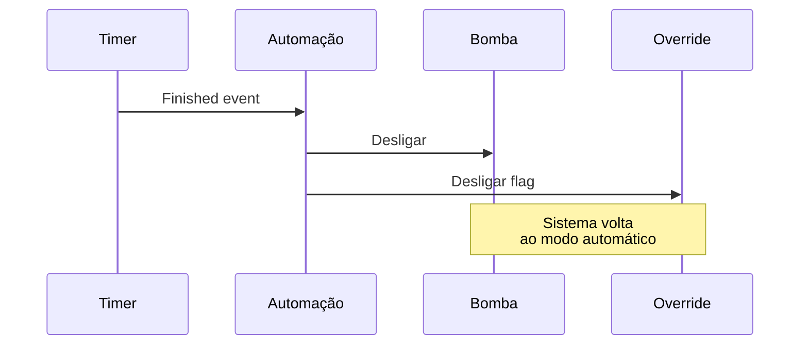

#### 🔧 Entidades Relacionadas

**Input:**
- ⏱️ `timer.piscina_manual`

**Outputs:**
- 💨 `switch.bomba_piscina_switch_0`
- 🔄 `input_boolean.piscina_override_manual`

</details>

---

<details>
<summary><h3>1️⃣9️⃣ 💧 Cascata</h3></summary>

#### 📋 Informação Geral

| Campo | Valor |
|-------|-------|
| **ID** | `cascata` |
| **Modo** | `single` |
| **Prioridade** | 🔵 Baixa |
| **Tipo** | Feature Control |

#### 🎯 Função
Toggle da cascata decorativa com botão físico.

#### ⚡ Triggers
- 🔘 **Device:** Botão BTHome (pressão simples)
  - Device ID: `50eb20ac53472c3cc1b1da733634d1c8`

#### 🔧 Entidades Relacionadas

**Output:**
- 💧 `44b25a719c3fa50cbbd4ebd6e57fcdb9` (cascata)

</details>

---

<details>
<summary><h3>2️⃣0️⃣ 💨 Hidrojet</h3></summary>

#### 📋 Informação Geral

| Campo | Valor |
|-------|-------|
| **ID** | `hidrojet` |
| **Modo** | `restart` |
| **Prioridade** | 🔵 Baixa |
| **Tipo** | Feature Control |

#### 🎯 Função
Ativa hidrojet com duplo clique, desligando temporariamente bomba principal e automação diurna para evitar conflitos.

#### ⚡ Triggers
- 🔘 **Device:** Botão BTHome (duplo clique)
  - Device ID: `50eb20ac53472c3cc1b1da733634d1c8`

#### 🔄 Funcionamento Complexo

```mermaid
stateDiagram-v2
    [*] --> CheckState: Duplo Clique
    
    CheckState --> LigarHidro: Hidrojet OFF
    CheckState --> DesligarHidro: Hidrojet ON
    
    LigarHidro --> DesligarBomba: 1. Desligar bomba
    DesligarBomba --> DesligarAuto: 2. Desligar automação
    DesligarAuto --> Delay: 3. Delay 5s
    Delay --> LigarSwitch: 4. Ligar hidrojet
    LigarSwitch --> Loop: 5. Loop monitor
    
    Loop --> CheckHidro: A cada 30s
    CheckHidro --> Loop: Ainda ON
    CheckHidro --> LigarAuto: Hidrojet OFF
    
    DesligarHidro --> DesligarSwitch: Desligar hidrojet
    DesligarSwitch --> LigarAuto
    
    LigarAuto --> [*]: Reativar automação
```

#### 🔧 Entidades Relacionadas

**Inputs:**
- 💨 `switch.bomba_piscina_switch_0` (bomba principal)
- 💨 `a282d1ef3a0591beb9ddf1392c8e3e42` (hidrojet)
- ⚙️ `automation.bomba_piscina_dia`

#### ⚠️ PROBLEMA IDENTIFICADO

> 🔴 **CRÍTICO**: Referência a `automation.bomba_piscina_dia` inexistente!

</details>

---

### 📱 RELATÓRIOS

<details>
<summary><h3>2️⃣1️⃣ 📊 Relatório Diário ChatGPT</h3></summary>

#### 📋 Informação Geral

| Campo | Valor |
|-------|-------|
| **ID** | `openai_daily_piscina` |
| **Modo** | `single` |
| **Prioridade** | 🔵 Baixa |
| **Tipo** | AI Report |

#### 🎯 Função
Gera relatório diário humorístico sobre estado da piscina usando ChatGPT, com análise de suficiência de filtragem.

#### ⚡ Triggers
- ⏰ **Time:** 20:30

#### 🤖 Prompt para ChatGPT

```
Para esta tarefa, és um consultor de piscinas e queres garantir 
sempre que a piscina está limpa e pronta a usar.

Mostra quando vai ser iniciada a filtragem da noite.
Calcula se as horas de filtragem são suficientes, usa os dados 
que são enviados.

Podes e deves usar um tom humorista. Podes usar emojis.
Responde em português de Portugal sem gerúndio.
```

#### 📊 Dados Enviados

| Métrica | Entity | Descrição |
|---------|--------|-----------|
| ⏱️ Filtragem Hoje | `sensor.duracao_filtragem_piscina_diario` | Tempo bomba ativa |
| 🌡️ Aquecimento | `sensor.duracao_aquecimento_piscina_diario` | Tempo aquecimento |
| 🌡️ Temperatura | `sensor.bomba_piscina_temperature` | Temp. atual |
| ⏱️ Tempo Restante | `sensor.pool_pump_remaining_time` | A filtrar |
| 🌙 Horário Noite | `sensor.bomba_piscina_noite_horario` | Início compensação |
| ⚙️ Threshold | `input_number.pool_pump_duration_lower_threshold` | Minutos mínimos |
| ⚡ Energia | `sensor.energia_emonpi_piscina_use_total_kwhd` | kWh gastos |

#### 📝 Contexto Adicional
- **Volume Piscina:** 66 m³
- **Potência Bomba:** 1.5 CV

#### 📱 Output
Mensagem enviada via Telegram com título "Piscina".

#### 🔧 Entidades Relacionadas

**IA:**
- 🤖 `conversation.chatgpt`

**Output:**
- 📱 `telegram_bot.send_message`

</details>

---

## 🔗 Entidades Utilizadas

### 📊 Resumo por Tipo

<div align="center">

| Tipo | Quantidade | Exemplos |
|------|------------|----------|
| 🔄 **Switches** | 6 | Bomba, Clorador, Aquecimento, Wallbox |
| 📊 **Sensors** | 15+ | pH, Temperatura, Filtragem, Energia |
| 🔄 **Input Booleans** | 5 | Sal, Cobertura, TPO, Override |
| 🔢 **Input Numbers** | 11 | pH, Temperatura, Thresholds, Streaks |
| 📝 **Input Texts** | 2 | Backups de pH |
| ⏰ **Input Datetime** | 1 | Horário bomba noite |
| 📸 **Cameras** | 2 | Cave (clorador/pH), Eira (cobertura) |
| ⏱️ **Timers** | 1 | Timer manual |
| 🔘 **Devices** | 2 | Botões BTHome |

</div>

---

### 🔄 Switches Críticos

<table>
<tr>
<th>Entity ID</th>
<th>Função</th>
<th>Automações</th>
</tr>
<tr>
<td><code>switch.bomba_piscina_switch_0</code></td>
<td>💨 Bomba Principal</td>
<td>Todas de filtragem</td>
</tr>
<tr>
<td><code>switch.piscina_cloro_permitir_producao</code></td>
<td>💧 Clorador</td>
<td>#1, #2, #3</td>
</tr>
<tr>
<td><code>switch.aquecimento_piscina_channel_1</code></td>
<td>🌡️ Aquecimento</td>
<td>#9</td>
</tr>
<tr>
<td><code>switch.wallbox_charging_enabled</code></td>
<td>🔌 Wallbox EV</td>
<td>#11</td>
</tr>
</table>

---

### 📊 Sensores de Monitorização

<details>
<summary><b>📈 Ver Lista Completa</b></summary>

#### 🔬 Qualidade da Água
- `sensor.bomba_piscina_temperature` - Temperatura atual
- `input_number.ph_piscina` - pH validado
- `input_number.ph_piscina_raw` - pH bruto
- `input_number.temperatura_piscina_filtrado` - Temp. filtrada

#### ⚡ Energia e Potência
- `sensor.potencia_emonpi_import_export_media_5_minutos` - Potência média
- `sensor.energia_emonpi_piscina_use_total_kwhd` - Energia total
- `binary_sensor.piscina_excedente_fv_bomba` - Excedente disponível

#### ⏱️ Tempo e Histórico
- `sensor.duracao_filtragem_piscina_diario_em_segundos` - Tempo hoje (s)
- `sensor.duracao_filtragem_piscina_diario` - Tempo hoje (formatado)
- `sensor.filtragem_piscina_historico_s` - Histórico 10 dias
- `sensor.duracao_aquecimento_piscina_diario` - Aquecimento hoje
- `sensor.pool_pump_remaining_time` - Tempo restante
- `sensor.bomba_piscina_noite_horario` - Horário calculado

#### 🌤️ Meteorologia
- `sensor.media_de_cobertura_de_nuvens_10_00_18_00` - Cobertura nuvens
- `sensor.season` - Estação do ano

#### 🚗 Veículo Elétrico
- `device_tracker.i4_edrive40` - Localização
- `binary_sensor.i4_edrive40_connection_status` - Conexão
- `sensor.i4_edrive40_remaining_battery_percent` - Bateria

</details>

---

### 🎛️ Input Numbers Configuráveis

<details>
<summary><b>⚙️ Ver Configurações</b></summary>

#### 🧪 Cloração
- `input_number.piscina_cloro_janela_min` - Janela TPO (minutos)
- `input_number.piscina_pct_cobertura_fechada` - % fechada (padrão: 30)
- `input_number.piscina_pct_cobertura_aberta` - % aberta (padrão: 100)
- `input_number.piscina_sal_baixo_off_streak` - Contador OFF
- `input_number.piscina_sal_baixo_off_debounce` - Threshold (padrão: 3)

#### 💨 Filtragem
- `input_number.pool_pump_duration_lower_threshold` - Verão (min)
- `input_number.pool_pump_duration_inverno` - Inverno (min)
- `input_number.piscina_filtracao_min_restantes` - Minutos restantes

#### 🔬 Qualidade
- `input_number.ph_piscina` - pH validado
- `input_number.ph_piscina_raw` - pH bruto
- `input_number.temperatura_piscina_filtrado` - Temperatura

</details>

---

### 📸 Câmaras e IA

<table>
<tr>
<th>Câmara</th>
<th>Localização</th>
<th>Uso</th>
<th>Resolução</th>
</tr>
<tr>
<td><code>camera.cave_hd_stream</code></td>
<td>🏠 Cave</td>
<td>Clorador (sal) + pH</td>
<td>1280px</td>
</tr>
<tr>
<td><code>camera.eira_piscina_hd_stream</code></td>
<td>🏊 Eira</td>
<td>Estado cobertura</td>
<td>960px</td>
</tr>
</table>

**🤖 LLM Provider:**
- ID: `01K5S60RJSW6MFMB543KEDHE23`
- Modelo: GPT-4o-mini (OpenAI)
- Uso: Análise de imagens (sal, pH, cobertura)

---

## ⚠️ Problemas Identificados

### 🔴 Críticos

<details>
<summary><h3>1. Automação "bomba_piscina_dia" Inexistente</h3></summary>

#### 📍 Localização
- **Automação #11:** `ligardesligar_automacao_piscina`
- **Automação #20:** `hidrojet`

#### 🔍 Problema
Múltiplas automações tentam controlar `automation.bomba_piscina_dia` que não existe no sistema.

#### 💥 Impacto

```mermaid
graph TB
    A[#11: Prioridade EV] -->|Tenta desligar| B[automation.bomba_piscina_dia]
    C[#20: Hidrojet] -->|Tenta desligar| B
    
    B -->|NÃO EXISTE| D[❌ Falha]
    
    D --> E[Erro no log]
    D --> F[Conflito não gerido]
    D --> G[Comportamento inesperado]
    
    style B fill:#ffcdd2
    style D fill:#f44336,color:#fff
```

#### 🛠️ Soluções Possíveis

| Opção | Ação | Prioridade |
|-------|------|------------|
| **A** | Encontrar automação renomeada/movida | 🔴 Alta |
| **B** | Recriar automação se foi eliminada | 🔴 Alta |
| **C** | Remover referências se desnecessária | 🟡 Média |
| **D** | Substituir por lógica alternativa | 🟡 Média |

#### 📝 Recomendação
Investigar histórico de commits para encontrar quando/porque foi removida.

</details>

---

### 🟡 Avisos

<details>
<summary><h3>2. Uso de Device IDs Não Legíveis</h3></summary>

#### 📍 Automações Afetadas
- #13, #17, #19, #20, #21

#### 🔍 Problema
Uso de IDs obscuros em vez de entity_ids descritivos.

#### 📊 Exemplos

| ❌ Device ID | ✅ Entity ID Sugerido |
|-------------|----------------------|
| `d1b3ca4d6a...` | `switch.bomba_piscina_switch_0` |
| `ae742d0d2f...` | `switch.bomba_piscina` |
| `44b25a719c...` | `switch.cascata_piscina` |
| `a282d1ef3a...` | `switch.hidrojet_piscina` |

#### 💡 Benefícios da Conversão
- ✅ Código autodocumentado
- ✅ Mais fácil de debugar
- ✅ Resistente a substituição de hardware
- ✅ Melhor em code reviews

</details>

---

<details>
<summary><h3>3. Redundância entre #14 e #15</h3></summary>

#### 🔍 Análise

Ambas fazem arranque por excedente FV:

| Aspeto | #14 Arranque FV | #15 Watchdog |
|--------|-----------------|--------------|
| **Trigger** | Sensor ON 2min | Timer 2min |
| **Natureza** | Reativo | Proativo |
| **Risco** | Pode falhar | Sempre verifica |

#### 🤔 Pergunta
A redundância é intencional (failsafe) ou acidental?

#### ✅ Se Intencional
Documentar claramente o propósito de cada uma:
- #14: Sistema principal de deteção
- #15: Sistema de backup/recuperação

#### ⚠️ Se Acidental
Considerar:
- Manter só #15 (mais robusto)
- Ou aumentar intervalo de #15 para 5min

</details>

---

<details>
<summary><h3>4. Confusão entre Entidades da Bomba</h3></summary>

#### 🔍 Problema
Existem duas entidades similares:
- `switch.bomba_piscina`
- `switch.bomba_piscina_switch_0`

#### 📊 Uso nas Automações

| Automação | Usa `bomba_piscina` | Usa `bomba_piscina_switch_0` |
|-----------|---------------------|------------------------------|
| #14 | ✅ | ✅ (ambas) |
| #15 | ❌ | ✅ |
| #17 | ❌ | ✅ |
| Outras | ❌ | ✅ |

#### 🤔 Questões
1. São a mesma bomba (alias)?
2. São diferentes (principal vs auxiliar)?
3. Uma está obsoleta?

#### 🛠️ Recomendação
1. Verificar no Lovelace/Entities
2. Testar comportamento
3. Padronizar uso em TODAS automações
4. Documentar diferença se existir

</details>

---

### 🟢 Melhorias Sugeridas

<details>
<summary><h3>5. Sistema de Logging Inconsistente</h3></summary>

#### 📊 Estado Atual

| Automação | Logging | Nível |
|-----------|---------|-------|
| #10 (Bomba Noite) | ✅ Completo | ⭐⭐⭐⭐⭐ |
| #1-9, #11-21 | ❌ Ausente | ⭐☆☆☆☆ |

#### 💡 Recomendação

Adicionar logging a:

**🔴 Prioridade Crítica:**
- #2, #3 (Cloração TPO + Failsafe)
- #11 (Prioridade EV/Piscina)

**🟡 Prioridade Alta:**
- #14, #15 (Arranque FV)
- #1 (Sal baixo)
- #6 (pH)

#### 📝 Template de Log

```yaml
- action: system_log.write
  data:
    message: >
      [AUTOMAÇÃO_ID] Ação executada:
        Trigger: {{ trigger.id }}
        Condições: {{ conditions_met }}
        Valores: {{ relevant_values }}
    level: info
    logger: automations.piscina
```

</details>

---

<details>
<summary><h3>6. Notificações Limitadas</h3></summary>

#### 📱 Notificações Atuais

| Automação | Tipo | Quando |
|-----------|------|--------|
| #5 | Telegram | Cobertura aberta |
| #10 | Persistent | Bomba noite |
| #21 | Telegram | Relatório diário |

#### 💡 Sugestões de Novas Notificações

**🔴 Críticas:**
- 🧂 Sal baixo detectado (automação #1)
- 🧪 pH fora de range crítico (< 6.5 ou > 8.0)
- ⚠️ Bomba falhou ao ligar após N tentativas
- 🛡️ Failsafe ativado (#3)

**🟡 Avisos:**
- ⏱️ Filtragem insuficiente por 3+ dias
- 📊 Energia consumida acima do normal
- 🌡️ Temperatura anormal

**🟢 Informativas:**
- ✅ Bomba noite concluída
- 📊 Resumo semanal

#### 📝 Template Telegram

```yaml
- action: telegram_bot.send_message
  data:
    title: "🏊 Piscina - {{ alert_type }}"
    message: >
      {{ emoji }} {{ alert_message }}
      
      📊 Estado Atual:
        - pH: {{ states('input_number.ph_piscina') }}
        - Temperatura: {{ states('sensor.bomba_piscina_temperature') }}°C
        - Filtragem Hoje: {{ states('sensor.duracao_filtragem_piscina_diario') }}
```

</details>

---

<details>
<summary><h3>7. Validação de Estado Pós-Ação</h3></summary>

#### 🔍 Problema
Poucas automações verificam se ação foi bem-sucedida.

#### ✅ Boa Prática (#10)

```yaml
- repeat:
    while:
    - condition: state
      entity_id: switch.bomba_piscina_switch_0
      state: 'off'
    - condition: template
      value_template: '{{ repeat.index <= 20 }}'
    sequence:
    - action: switch.turn_on
      target:
        entity_id: switch.bomba_piscina_switch_0
    - delay: 10
```

#### 📋 Automações a Melhorar

| Automação | Ação Crítica | Validação? |
|-----------|--------------|------------|
| #2 | Ligar/desligar clorador | ❌ |
| #14 | Ligar bomba | ❌ |
| #18 | Ligar bomba (watchdog) | ❌ |

#### 💡 Recomendação
Adicionar verificação de estado após ações críticas.

</details>

---

<details>
<summary><h3>8. Janela Horária Hardcoded (#16)</h3></summary>

#### 🔍 Problema
Automação #16 só atualiza entre 13:00-21:00.

#### 🤔 Questões
1. Porquê esta janela específica?
2. O que acontece fora deste horário?
3. É baseado em comportamento solar?

#### 💡 Recomendações

**Opção A - Documentar:**
```yaml
# Horário 13:00-21:00 permite:
# - Análise da filtragem matinal
# - Previsão baseada em cobertura de nuvens
# - Tempo para utilizador ajustar se necessário
```

**Opção B - Tornar Configurável:**
```yaml
conditions:
  - condition: time
    after: input_datetime.horario_update_start
    before: input_datetime.horario_update_end
```

</details>

---

## 💡 Recomendações

### 🎯 Prioridade ALTA (Ação Imediata)

<div align="center">

| # | Recomendação | Impacto | Esforço |
|---|--------------|---------|---------|
| **1** | 🔍 Resolver `automation.bomba_piscina_dia` | 🔴🔴🔴 | 2-4h |
| **2** | 📝 Padronizar entidades da bomba | 🔴🔴 | 1-2h |
| **3** | 🔄 Converter device_ids para entity_ids | 🟡🟡 | 2-3h |

</div>

---

### 📋 Prioridade MÉDIA (Próximas Semanas)

<details>
<summary><b>Ver Lista Completa</b></summary>

#### 4️⃣ Melhorar Logging
**Tempo:** 3-4 horas  
**Benefício:** Debugamento mais fácil

Adicionar `system_log.write` em:
- Todas automações críticas (#2, #3, #11)
- Pontos de decisão importantes
- Início/fim de operações longas

---

#### 5️⃣ Expandir Notificações
**Tempo:** 2-3 horas  
**Benefício:** Alertas proativos

Implementar:
- Sal baixo (Telegram)
- pH crítico (Telegram + Persistent)
- Falhas de arranque
- Resumo semanal

---

#### 6️⃣ Documentar Configurações
**Tempo:** 2 horas  
**Benefício:** Manutenção facilitada

Criar `docs/CONFIGURACAO_PISCINA.md` com:
- Valores recomendados para input_numbers
- Explicação de thresholds
- Guia de ajuste sazonal
- Troubleshooting comum

</details>

---

### 🔧 Prioridade BAIXA (Otimizações Futuras)

<details>
<summary><b>Ver Sugestões</b></summary>

#### 7️⃣ Otimizar Polling
**Análise:** #1 corre a cada 30s (intensivo)

**Considerar:**
- Aumentar para 60s se sistema estável
- Implementar trigger alternativo baseado em evento
- Análise de performance do LLM

---

#### 8️⃣ Dashboard de Configuração
**Criar interface unificada com:**
- 🎛️ Todos controlos num só local
- 📊 Valores históricos (gráficos)
- 🚦 Estado atual do sistema
- ⚙️ Configurações rápidas

**Tecnologia:** Lovelace custom card

---

#### 9️⃣ Testes Automatizados
**Implementar:**
- Scripts para testar cenários
- Validação de configurações
- Simulação de falhas
- CI/CD para automações

---

#### 🔟 Analytics Avançados
**Adicionar:**
- Correlação temperatura × filtragem
- Análise custo/benefício aquecimento
- Previsão de manutenção
- ML para otimização de thresholds

</details>

---

## 📊 Resumo Executivo

<div align="center">

### ✅ Pontos Fortes

</div>

<table>
<tr>
<td width="25%" align="center">
<h3>🤖</h3>
<b>Visão Computacional</b><br>
<small>Uso inovador de LLM para leitura de pH, deteção de sal e estado da cobertura</small>
</td>
<td width="25%" align="center">
<h3>⚙️</h3>
<b>Sistema TPO</b><br>
<small>Cloração inteligente proporcional ao estado da cobertura</small>
</td>
<td width="25%" align="center">
<h3>☀️</h3>
<b>Gestão Energética</b><br>
<small>Priorização solar com coordenação EV e watchdogs</small>
</td>
<td width="25%" align="center">
<h3>🛡️</h3>
<b>Redundância</b><br>
<small>Múltiplas camadas de segurança e failsafes</small>
</td>
</tr>
<tr>
<td width="25%" align="center">
<h3>💾</h3>
<b>Persistência</b><br>
<small>Backups automáticos de valores críticos com restore</small>
</td>
<td width="25%" align="center">
<h3>📊</h3>
<b>Histórico</b><br>
<small>Tracking de 10 dias para análise de tendências</small>
</td>
<td width="25%" align="center">
<h3>🌙</h3>
<b>Compensação</b><br>
<small>Sistema noturno inteligente com ajuste sazonal</small>
</td>
<td width="25%" align="center">
<h3>🎮</h3>
<b>Controlo</b><br>
<small>Integração botões físicos + overrides manuais</small>
</td>
</tr>
</table>

---

<div align="center">

### ⚠️ Áreas de Melhoria

</div>

<table>
<tr>
<th>Categoria</th>
<th>Problema</th>
<th>Severidade</th>
<th>Ação</th>
</tr>
<tr>
<td>🔗 <b>Integração</b></td>
<td>Automação <code>bomba_piscina_dia</code> inexistente</td>
<td>🔴 <b>Crítica</b></td>
<td>Investigar e resolver</td>
</tr>
<tr>
<td>📝 <b>Código</b></td>
<td>Device IDs não legíveis</td>
<td>🟡 <b>Média</b></td>
<td>Converter para entity_ids</td>
</tr>
<tr>
<td>🔄 <b>Redundância</b></td>
<td>Automações #14 e #15 duplicadas</td>
<td>🟢 <b>Baixa</b></td>
<td>Documentar propósito</td>
</tr>
<tr>
<td>📊 <b>Monitorização</b></td>
<td>Logging inconsistente</td>
<td>🟡 <b>Média</b></td>
<td>Adicionar logs críticos</td>
</tr>
<tr>
<td>📱 <b>Alertas</b></td>
<td>Notificações limitadas</td>
<td>🟢 <b>Baixa</b></td>
<td>Expandir sistema</td>
</tr>
</table>

---

<div align="center">

### 📈 Estatísticas do Sistema

</div>

```mermaid
pie title Distribuição de Automações por Categoria
    "Cloração (19%)" : 4
    "Qualidade (24%)" : 5
    "Filtragem (33%)" : 7
    "Manual (19%)" : 4
    "Relatórios (5%)" : 1
```

<table>
<tr>
<td align="center">
<h1>21</h1>
<small>Automações<br/>Totais</small>
</td>
<td align="center">
<h1>2</h1>
<small>Câmaras<br/>HD</small>
</td>
<td align="center">
<h1>15+</h1>
<small>Sensores<br/>Ativos</small>
</td>
<td align="center">
<h1>6</h1>
<small>Switches<br/>Controlados</small>
</td>
<td align="center">
<h1>10</h1>
<small>Dias de<br/>Histórico</small>
</td>
<td align="center">
<h1>30s</h1>
<small>Frequência<br/>Min. Monitor</small>
</td>
</tr>
</table>

---

<div align="center">

### 🎓 Nível de Sofisticação

<table>
<tr>
<th>Aspeto</th>
<th>Avaliação</th>
<th>Comentário</th>
</tr>
<tr>
<td>🤖 <b>IA Integration</b></td>
<td>⭐⭐⭐⭐⭐</td>
<td>Estado da arte em automação residencial</td>
</tr>
<tr>
<td>⚡ <b>Energy Mgmt</b></td>
<td>⭐⭐⭐⭐⭐</td>
<td>Priorização solar exemplar</td>
</tr>
<tr>
<td>🛡️ <b>Safety</b></td>
<td>⭐⭐⭐⭐⭐</td>
<td>Múltiplas camadas de proteção</td>
</tr>
<tr>
<td>📊 <b>Monitoring</b></td>
<td>⭐⭐⭐⭐☆</td>
<td>Excelente, pode melhorar logging</td>
</tr>
<tr>
<td>📝 <b>Code Quality</b></td>
<td>⭐⭐⭐☆☆</td>
<td>Funcional mas precisa refactoring</td>
</tr>
<tr>
<td>📚 <b>Documentation</b></td>
<td>⭐⭐⭐⭐⭐</td>
<td>Este documento ;)</td>
</tr>
</table>

### 🏆 Classificação Geral: **AVANÇADO**

<small>Sistema altamente sofisticado com tecnologias de ponta, algumas áreas de melhoria na manutenibilidade</small>

</div>

---

<div align="center">

## 👨‍💻 Metadados do Documento

**📅 Data:** 31 de Janeiro de 2026  
**✍️ Autor:** Análise Automatizada Home Assistant  
**📌 Versão:** 2.0 (Design Melhorado)  
**🏷️ Tags:** `piscina` `automação` `llm-vision` `solar` `home-assistant`

---

### 📄 Ficheiros Relacionados

- 📂 [`automations.yaml`](../automations.yaml) - Definições das automações
- 📊 [`configuration.yaml`](../configuration.yaml) - Configuração principal
- 🔧 [`sensors/`](../sensors/) - Definições de sensores custom

---

### 🔗 Links Úteis

[](https://www.home-assistant.io/docs/)
[](https://github.com/valentinfrlch/ha-llmvision)
[](https://community.home-assistant.io/)

---

<sub>Gerado por análise automatizada • Para questões ou sugestões, abrir issue no repositório</sub>

</div>
